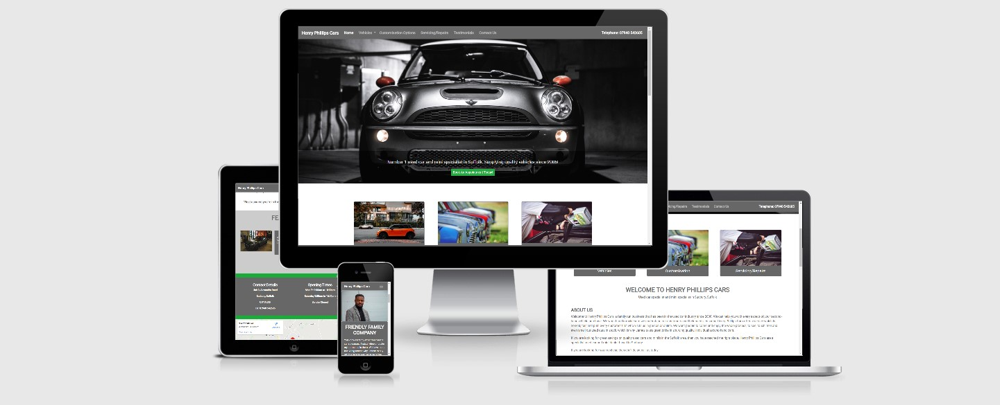

## Henry Phillips Cars

A comprehensive used car dealership website based in Sudbury, the United Kingdom. The website will feature a number of videos and images of vehicles which are currently available to buy from this dealership. Helping customers make a better informed decision on there next used car preferences. The website will consist of multiple separate pages to include a description of the business and owner, descriptions of available vehicles for purchase, with walk around videos and images, services and repairs offered by the business and customisation and additional optional extras at vehicle purchase.

The primary goal of the website is to show case the experience and quality of products offered and give customers the ability to make first contact with the business owner via a contact page and book in for an appointment to view stock.

The website will be to encourage customers to feel confident and comfortable in booking appointments to view vehicles without feeling pressured to purchase. Unlike other websites of this nature the owner is looking to showcase his products visually and honestly to potential customers visiting the website.

##### The business goals for this website are:

- To show customers high quality vehicles available to buy from the business.
- To provide customers with servicing and repair options.
- To showcase the Business brand.
- Increase footfall by giving the business an online presence.
- To give customers the ability to contact the business online to book appointments.

##### The customer goals of the website are:

- To make searching for their next used vehicle easy and informative.
- Servicing and repairs are easily booked in and enquired about via the website.
- The customers have the ability to choose alterations and extras for the potential purchase of their next vehicle.

### UX

##### Client Stories:

1. New visitors want a visually pleasing experience which gives them a clear understanding of the business and the business offering.
2. New visitors want to be able to get as much details of stock and vehicles so they can then make the decision to book an appointment to view the vehicle.
3. New visitors want to be able to fully understand the offering of the business quickly and efficiently when visiting the website.
4. New visitors are looking to be able to have multiple choices and options when visiting the website.
5. Potential buyers want the ability to find out more about the business owner and business to help them build trust and confidence in make a decision to buy.
6. Potential buyers are looking for a business where they will be able to return for maintenance and servicing after the initial purchase of their vehicle.
7. Potential buyers want to be able to book in for an appointment quickly and easily and understand the whole purchase process from start to finish.
8. Returning visitors want to be able to view prices for servicing and repairs easily.

##### This website build is the best way of achieving these things because:

- Most used car dealership websites are bulky and very complicated. they are always very cluttered and do not have easy navigation with too much choice for the visitor or new customer.
- Other sites seem to be focusing mainly of the vehicles and services and less on the actual business and history of the owners.
- This website is:
  - Visually pleasing and easy to navigate.
  - Gives history and information on the business, owner, products, and services which do not give sensory overload.
  - Has easy to follow steps.
  - Gives new customers the confidence to book an appointment quickly and easily understanding the process that they will undertake when visiting the business and owner.

##### Visitors to this website are looking for:

- A business to buy a used second hand car which gives them confidence and trust in the product.
- The ability to make the choice and return for future services, repairs, and maintenance.
- A personable service when purchasing their vehicle.

##### The Ideal Client/Customer:

- Looking for their next vehicle
- Has disposable income
- Lives in Suffolk (but can be located anywhere in the UK)
- Looking for servicing, repairs, or maintenance on their current vehicle or future vehicle.

##### Wireframe Mock-ups:

[Mobile First Design](documentation/wireframes/henry-phillips-cars-mobile-first-concept.png)

[Home Page](documentation/wireframes/home-page-layout.png)

[Vehicles Page](documentation/wireframes/vehicles-page-layout.png)

[Customisation and Options Page](documentation/wireframes/customisation-and-options-page-layout.png)

[Servicing and Repairs Page](documentation/wireframes/servicing-and-repairs-page-layout.png)

[Testimonials Page](documentation/wireframes/testimonials-page-layout.png)

[Contact Us Page](documentation/wireframes/contact-us-page-layout.png)

##### Colours and typography:

- Colours:
  After sitting down with the business owner and looking at a number of current websites with competitors,
  including main dealer car dealership websites we found that they were of neutral colours with a slight colour pop within the site.
  Usually to give more enthasis on quality and prestige. Under the advice of the business ownere the colours agreed were greys and greens to use as the colour pop within the site and dark grey and white for the text.

- Typography:
  "Roboto" font with the fallback of sans-serif for all headings and body content throughout the website.
  This was chosen for the clear professional style to make the content easily readable and universal throughout the site.

  "Noto Sans JP" with fallback of sans-serif was chosen as an additional typography for future developement and a change of style should we want to refresh the content on future versions

### Features

##### Mobile First Design:

- Expandable menu in header
- Hero image
- Active pictures/buttons to websites other pages
- Vehicles
- Custom and Options
- Servicing and Repairs
- Testimonials (optional)
- Screen scroll to about us details
- Featured car at bottom of screen with carousel images
- footer to hold contact details and social media links

##### Home Page:

- Hero image
- Active pictures/buttons to websites other pages
- Vehicles
- Custom and Options
- Servicing and Repairs
- Testimonials (optional)
- Contact Us form page
- Screen scroll to about us details
- Featured car at bottom of screen with carousel images
- Contact us banner
- Local map
- Social links and copyright

##### Vehicles Page:

- Hero image
- Active buttons to other pages
- Current vehicle pictures with carousel images and vehicle description enquire by a button which takes you to the contact us page with further instructions
- Contact us banner
- Local map
- Social links and copyright

##### Customisation and Options Page:

- Hero image
- Active buttons to other pages
- Current vehicle customisation options and prices
- Contact us banner
- Local map
- Social links and copyright

##### Servicing and Repairs Page:

- Hero image
- Current services options and prices
- Contact us banner
- Local map
- Social links and copyright

##### Testimonials Page:

- Hero image
- Customer testimonials and picture of customer
- Contact us banner
- Local map
- Social links and copyright

##### Contact Us Page:

- Hero image
- Contact form
- Contact us banner
- Local map
- Social links and copyright

### Existing Features

- Header and logo (hero image)
- Nav bar
- Footer copyright info and social icons
- Call to action buttons and contact details
- Carousel images and site images exist on every page
- Mobile First Design
- Home Page
- Vehicles Page
- Customisation and Options Page
- Servicing and Repairs Page
- Testimonials Page
- Contact Us Page

### Features to implement in the future

- Chat Bot
- FAQ page
- Order form for parts and accessories
- Book a service or repair function
- Part Exchange form
- Walk around videos of vehicles for great visibility to customers

### Technologies Used

1. HTML5
2. CSS3
3. [Bootstrap](https://getbootstrap.com/)
4. [Google Fonts](https://fonts.google.com/)
5. [Font Awesome](https://fontawesome.com/)
6. [Embed Google Maps](https://www.embedgooglemap.net/)

### Testing

- Testing documentation can be found on a separate document [HERE](documentation/TESTING.md)

### Deployment

- All code was written on Gitpod, (Integrated Development Environment).
- The code was then pushed to GitHub where it is stored in my [Repository](https://github.com/LeeWebb360/Henry-Phillips-Cars-1st-milestone-project).
- Under the Settings section of the GitHub repository, scrolled down to GitHub Pages section.
- Under 'Source' drop-down, the 'Master branch' was selected.
- Once selected, this publishes the project to GitHub Pages and displays the site URL.
- The code can be run locally through a download or cloned (Do this by opening the repository, clicking on the green 'Code' button and selecting either clone or download).
- The Clone option provides a URL, which you can use on your desktop IDE.
- The Download ZIP option provides a link to download a ZIP file which can be unzipped on your local machine.

### Credits

- All images for the website have been sourced from [www.unsplash.com](https://unsplash.com)
- Dropdown buttons adapted from Bootstrap and also Whiskey Drop CI project
- Navigation bar adapted from Bootstrap and also Whiskey Drop CI project
- HTML, CSS tips and tricks utilizing [Stack Overflow](https://stackoverflow.com/)
- Hero Image and jumbotron from [Bootstrap](https://getbootstrap.com/docs/4.5/components/jumbotron/)
- Carousels from [Bootstrap](https://getbootstrap.com/docs/4.5/components/carousel/)
- Embedded Google Map from [Embed Goggle Maps](https://www.embedgooglemap.net/)
- Social Media Icons from [Font Awesome](https://fontawesome.com/)
- Fonts and Font Families From [Google Fonts](https://fonts.google.com/)

### Acknowledgements
I would like to thank:

- My mentor, **Aaron Sinnott** for his advice and his guidance on this project before submission.
- **CI Staff** and **Slack Community** for being a huge source of information and quick with questions posted and assistance requests.
- **Everyone** that takes part in the **Slack calls**, and **Group channels**.
- **Jim Morel**, for his help on sorting out the screen wobble and padding on mobile devices, his direction on testing and the MS1 planning call he hosted.

